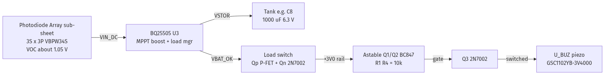
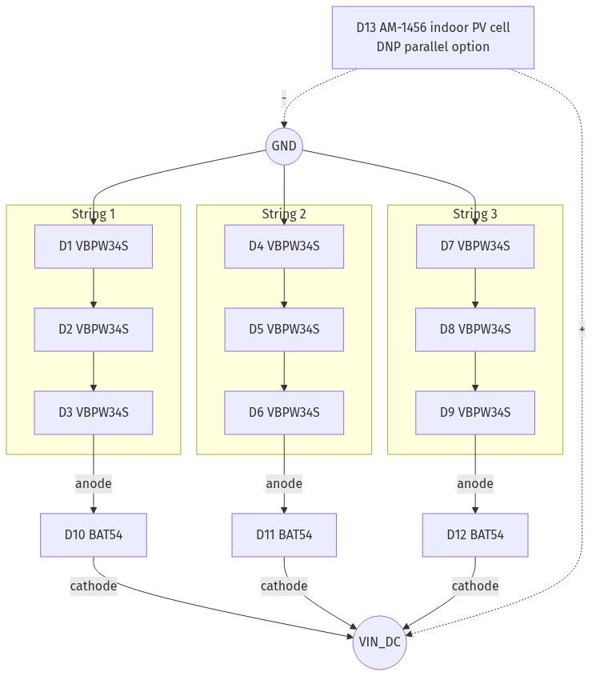
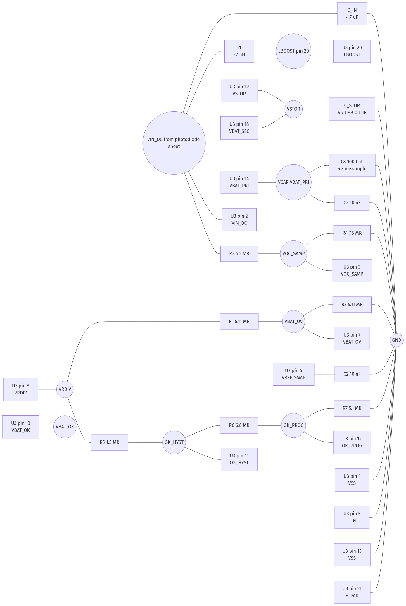
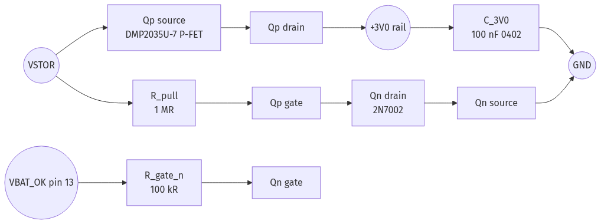
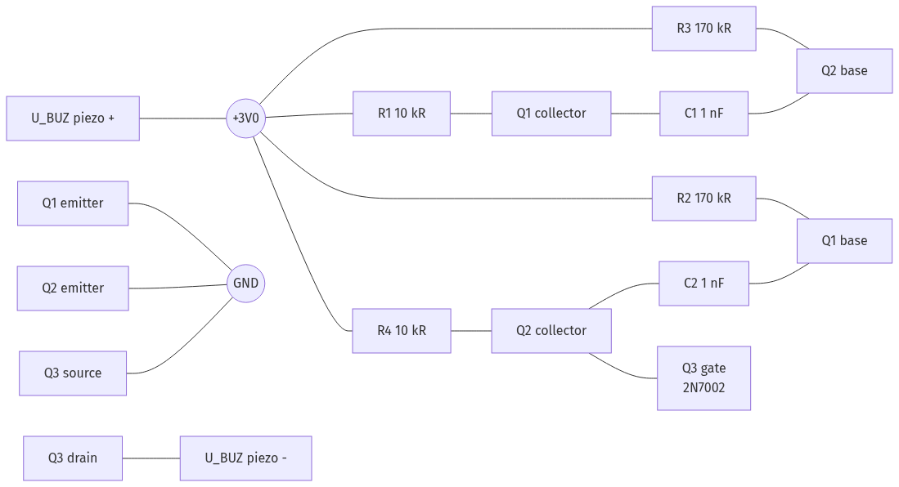

# Solar buzzer — KiCad implementation reference

Reference diagrams and wiring notes for the solar-diode–powered buzzer: photodiode array, BQ25505, load switch, and astable oscillator. Example values reference `jmny-crkt` and **`crktboi/power.kicad_sch`** as implemented.

**Same-sheet net labels:** In KiCad, **local (or global) labels** connect nets without drawing every wire across the sheet. **ERC**, **Tools → Update PCB from Schematic**, and **right-click → Highlight net** are authoritative. Simple geometric “tracers” that only follow wires and ignore label names will falsely show pins as unconnected.

**VSTOR vs VRDIV (TI datasheet):** Pin **19 (VSTOR)** is the boost output—“typically connected to the **system load**”—with **CSTOR** (e.g. 4.7 µF + 0.1 µF) to VSS. You do **not** tie the tops of the **VBAT_OV** / **VBAT_OK** resistor strings to VSTOR. Those strings are biased from pin **8 (VRDIV)** (“connect high side of resistor divider networks to this biasing voltage”). **OK_HYST** / **OK_PROG** are midpoints of dividers **between VRDIV and GND**. **VOC_SAMP** (MPPT) is a midpoint of a divider **between VIN_DC and GND** (or other connections per datasheet), not from VRDIV. The chip pulses VRDIV during sampling so divider current is not continuous.

**Wrong advice (do not follow):** “Connect VSTOR to the L1 / input-side tank node; relabel nets.” **Ignore that.** VSTOR is **not** on the inductor or VIN path. The only place `L1` belongs is **between VIN_DC (pin 2) and LBOOST (pin 20)**. The “tank” / bulk storage lives on **VBAT_PRI / VBAT_SEC / mux** per your topology—not wired to the switching node.

---

## 1. Overall block diagram

*Source: [`images/01-overall.mmd`](images/01-overall.mmd) — regenerate PNG via [Kroki](https://kroki.io) or `@mermaid-js/mermaid-cli`.*

---

## 2. Photodiode array (new sub-sheet `photodiode_array.kicad_sch`)

*Source: [`images/02-photodiode-array.mmd`](images/02-photodiode-array.mmd).*

**Notes**

- Each string: three VBPW34S in series, positive end through a BAT54 Schottky to `VIN_DC`, negative end to GND.
- Optional DNP footprint for `AM-1456` or `KXOB25-05X3F-TR` in parallel for later experiments.
- Export `VIN_DC` and `GND` as hierarchical labels to the top sheet.

---

## 3. BQ25505 (U3) — pin wiring

| Pin | Name (datasheet) | Connect to | Notes |
|-----|------------------|------------|--------|
| 1 | VSS | GND | Analog ground (remove stray `~EN` label if present) |
| 2 | VIN_DC | `VIN_DC` + `C_IN` 4.7 µF to GND + one side of `L1` | Input from solar array |
| 3 | VOC_SAMP | Midpoint of MPPT divider **between VIN_DC and GND** (`R3`/`R4` or as in datasheet) | Not fed from VRDIV |
| 4 | VREF_SAMP | `C2` 10 nF to GND | MPPT hold cap |
| 5 | ~EN | GND | Enables IC (active low) |
| 6 | NC | Open | — |
| 7 | VBAT_OV | Midpoint of `R1` / `R2` between **VRDIV** and GND | OV programming (datasheet Eq. 2) |
| 8 | VRDIV | **IC output:** top of `R1` and top of `R5` (high side of OV + OK ladders to GND) | Do not confuse with VSTOR |
| 9 | ~VB_SEC_ON | NC (or test point) | Output only |
| 10 | ~VB_PRI_ON | NC (or test point) | Output only |
| 11 | OK_HYST | `R5` / `R6` midpoint | Upper hysteresis tap |
| 12 | OK_PROG | `R6` / `R7` midpoint | Lower (drop-out) tap |
| 13 | VBAT_OK | `Qn` gate via `R_gate_n` 100 kΩ | Drives load switch |
| 14 | VBAT_PRI | `VCAP` net → bulk tank (e.g. **1000 µF 6.3 V** `C8` in crktboi) | Primary storage |
| 15 | VSS | GND | Power ground |
| 16 | NC | Open | — |
| 17 | NC | Open | — |
| 18 | VBAT_SEC | Secondary storage / same energy node as your tank (often commoned with VSTOR for one cap) | Datasheet: ≥100 µF equivalent if used as SEC |
| 19 | VSTOR | Boost output: **CSTOR** to GND, then **system path** (internal mux / external PFETs to rail, or your load switch) | **Not** the top of ROV/ROK dividers—that is **VRDIV** |
| 20 | LBOOST | Other side of `L1` | Boost switch node |
| 21 | E_PAD | GND | Exposed thermal pad |

### Power sheet schematic (target topology)

*Source: [`images/03-bq25505-power.mmd`](images/03-bq25505-power.mmd). Resistor designators in the figure are illustrative; match your sheet.*

### `crktboi` — pre-order verification (not a “todo” list)

Use this **after** your schematic is wired; it does **not** repeat steps you have already completed. If **ERC is clean** and nets match the datasheet, you are done with topology.

1. **Labels:** Confirm critical nets (`Vstore`, `VCAP`, `V_RDIV`, `VBAT_OK`, `+3V0`, `GND`, `VIN_DC`, `LBOOST`, etc.) with **Highlight net** — especially where you used **labels instead of long wires**.
2. **BQ25505 rules of thumb (TI):** `L1` only **VIN_DC ↔ LBOOST**; **VSTOR** is boost output + CSTOR + output path (not the top of OV/OK dividers — that is **VRDIV**); **MPPT** tap **VOC_SAMP** from a divider on **VIN_DC** / GND (not from VRDIV). If your sheet already follows that, no change needed.
3. **Tank:** You added **1000 µF 6.3 V** (`C8`); adjust only if chirp length / cadence needs tuning.
4. **Load switch (Q4 / Q5):** Topology is **N-FET** inverts **VBAT_OK**, **P-FET** high-side to **`+3V0`**. Double-check symbols vs footprint: **P-FET source → `Vstore`**, **drain → `+3V0`**; **N-FET source → GND**, **drain → P-FET gate**. Add **1 MΩ** `Vstore` → P-FET gate if you want a defined off-state (optional **100 kΩ** on **VBAT_OK → Q4 gate**, **100 nF** on **`+3V0`**).
5. **ERC / DRC:** Run schematic **ERC** and board **DRC** before fab; fix any **floating pin** or **power pin** warnings on **U4**.

---

## 4. Load switch (VSTOR to +3V0)

*Source: [`images/04-load-switch.mmd`](images/04-load-switch.mmd).*

**Behavior**

- `VBAT_OK` low → Qn off → Qp gate pulled to VSTOR via `R_pull` → `Vgs,Qp = 0` → Qp off → `+3V0` disconnected.
- `VBAT_OK` high → Qn on → Qp gate to GND → `Vgs,Qp ≈ -3 V` → Qp on → `+3V0 ≈ VSTOR`.
- Hysteresis is set by BQ25505 OK_HYST / OK_PROG.

---

## 5. Oscillator + buzzer (`oscillator.kicad_sch`)

Use a **standard** astable: collectors pull up to `+3V0` through `R1`/`R4`, emitters to GND. If the schematic had collectors on GND and emitters on the timing nets, flip it.

*Source: [`images/05-oscillator.mmd`](images/05-oscillator.mmd).*

**BC847 pinout (KiCad):** 1 = B, 2 = E, 3 = C.

**Edits**

- `Q1` / `Q2`: C through `R1` / `R4` to `+3V0`; E to GND; B to base resistor + cross cap.
- `Q3`: G on `Q2` collector; S on GND; D on piezo `-`. Piezo `+` on `+3V0`.
- Change oscillator `R1` and `R4`: **1 kΩ → 10 kΩ**.
- Keep `R2`, `R3`, `C1`, `C2` as in the resonance plan (~4 kHz for GSC1102YB).

---

## 6. Thresholds and cadence (existing power resistors)

With `V_BIAS = 1.21 V` (BQ25505 typical):

| Quantity | Formula | Value |
|----------|---------|--------|
| `VBAT_OV` | `1.5 × 1.21 × (1 + R1/R2)` with R1=R2=5.11 MΩ | **3.63 V** |
| `VBAT_OK_HYST` (load ON) | `1.21 × (1 + (R5+R6)/R7)` | **3.18 V** |
| `VBAT_OK_PROG` (load OFF) | `1.21 × (1 + R6/R7)` | **2.82 V** |
| MPPT ratio | `R4/(R3+R4)` | **≈ 55 %** (TEG-style; OK for photodiodes indoors) |

**1000 µF tank (between ~3.18 V and ~2.82 V)** — same as **1 mF**

- `E ≈ 0.5 × 1000 µF × (3.18² − 2.82²) ≈ 1.08 mJ`
- At ~1.5 mW chirp load: **~720 ms** tone
- At ~7 µW average harvest (500 lux ballpark): recharge **~155 s** (~2.5 min between chirps)

**Alternatives**

- **470 µF:** shorter chirp, faster cadence.
- **2.2 mF:** longer chirp, slower cadence.

---

## 7. Parts delta summary

**Add**

- 9× VBPW34S
- 3× BAT54 (string isolation)
- 1× AM-1456 or KXOB25-05X3F-TR footprint (DNP optional)
- 1× **1000 µF 6.3 V** on `VCAP` (e.g. `C8` / `JVJ6.3V1000M8X10` in crktboi), or 470–680 µF if you want shorter chirps
- 1× DMP2035U-7 (or AO3401) P-FET — Qp
- 1× 2N7002 — Qn (BOM can match Q3)
- 1× 1 MΩ 0402 — R_pull
- 1× 100 kΩ 0402 — R_gate_n
- 1× 100 nF 0402 — C_3V0 on `+3V0` after switch
- 1× 4.7 µF — C_IN, VIN_DC to GND
- 1× 10 µF — C_STOR, VSTOR to GND (if not already present as C1)

**Change**

- Oscillator `R1`, `R4`: 1 kΩ → **10 kΩ**

**Remove / DNP**

- Extra legacy 4700 µF footprints if you removed them in favor of one bulk cap
- Orphan `Vstore`-only caps if not on a real net

---

*Generated as a working reference for KiCad entry. Update values after bench verification.*
